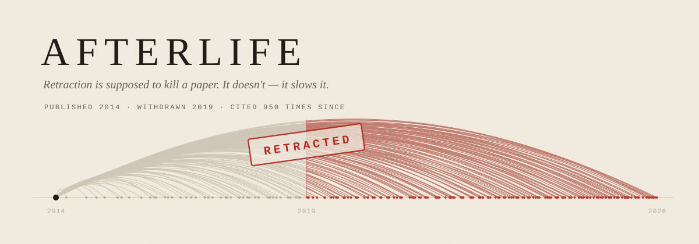

<div align="center">



<br><br>


**Kailash Parshad** · **Ilaqquan Rajesh Indure**

</div>

---

A retraction is a dated, public statement that a result should no longer be
treated as knowledge. **Afterlife** measures what happens to the citations
afterwards.

```bash
python3 -m http.server 5173     # then open http://localhost:5173
```

> [!NOTE]
> It has to be served over HTTP. The page fetches three JSON files, and a
> `file://` page treats each one as a separate origin and blocks the request.

<br>

## ◆ The finding

<div align="center">

| | | |
|:--:|:--:|:--:|
| **63%** | **177 / 300** | **0.62×** |
| of all citations arrived<br>*after* the retraction | papers cited more after<br>withdrawal than before | but the median paper's<br>citation **rate** after ÷ before |

</div>

91,713 of 144,992 citations to these 300 retracted papers arrived after the
paper was withdrawn.

**The third number is the one to lead with**, and it is the reason to trust
the rest. The median paper here spent 2 years valid and 4 years retracted, so
it simply had longer to accumulate posthumous citations. Normalise for that
and the median paper's citation rate falls to **0.62×** — and **63 of 205**
papers are cited *faster* per year after being withdrawn than before.

> Retraction cuts the citation rate by about a third.
> It does not stop it. Roughly a third of papers accelerate.

That version survives the first hard question. "Retraction has no effect"
does not.

<br>

## ◆ The part nobody has measured

Everything published on this counts the **first ring** — papers citing the
retracted paper directly. Those authors at least had it in their hands.

The **second ring** is papers citing one of *those*. Their authors have no
reason to know a retraction sits anywhere in their reference chain.

For the featured paper — *A Comprehensive Review on Metabolic Syndrome*,
published 2014, retracted 2019:

| | distinct works | after retraction |
|---|--:|--:|
| **ring 1** — cite it directly | 1,888 | 947 |
| **ring 2** — cite something that cites it | **57,765** | **52,341** |

Per year, the two rings move in **opposite directions**. Counting
transmission paths, direct citation peaks at 307 a year in 2018 and **falls
to 12** by 2026. Second-hand citation is 2,926 in 2018 and **climbs to
9,318** by 2024. The year before retraction there were 10 second-hand
citations for every direct one. By 2026 there are **396**.

> The correction reaches the first ring. It never reaches the second.

<br>

## ◆ Where in science this happens

| | |
|---|--:|
| baseline retraction rate across the map | **0.057%** |
| worst neighbourhood | **10.7%** — 188× the average |
| share of the map holding half of all retractions | **4.3%** (109 of 2,523 cells) |
| neighbourhoods with no retractions at all | **1,700 of 2,523** |

Hovering the worst one names it: **pharmacology**.

That is retraction behaving partly like a property of a *position* rather
than of a paper.

<br>

## ◆ What you are looking at

The page is one continuous scroll. Three views, each answering the next
question the previous one raises.

| | view | the question it answers | hover gives you |
|:--:|---|---|---|
| **1** | **One paper** | When did its citations arrive, relative to the retraction? | the year, the count, and which side of the line it fell on |
| **2** | **The map** | Is this everywhere, or somewhere? | the neighbourhood's subject, papers sampled, and its retraction rate |
| **3** | **Two rings** | Does the correction reach the people downstream? | the year, both rings' counts, and the ratio between them |

<br>

## ◆ What we deliberately do not claim

Say these before anyone asks. They are why the rest is trustworthy.

- **Retracted is not fraudulent.** Some of these are honest error or
  retract-and-replace. The data records a withdrawal, not a verdict on the
  authors.
- **The second ring is reachability, not influence.** A paper citing a paper
  that cited a retracted one may be citing its source for something entirely
  unrelated.
- **The second ring is also structurally later in time**, so part of its very
  high posthumous share is lag rather than contagion.
- **Paths are not works.** 65,736 transmission paths reach the second ring;
  57,765 *distinct works* do. A work inheriting the claim by three routes is
  counted three times in the first figure and once in the second. The two are
  never mixed, and 2026 is a partial year wherever it appears.
- **The map is topical, not social.** It is built from text similarity, so it
  shows that some *subjects* are far riskier than others — not that some
  research groups are. Those are different graphs.
- **Area on screen is not count.** In the first view later citations sweep
  across more space than earlier ones. The number in the corner is the
  quantity; the ink is not.
- **The sample is the most-cited retracted papers**, not a random draw. Papers
  nobody cited either way carry no signal, but it is a sampling choice and
  not a neutral one.

<br>

## ◆ The data

Three sources, because no single one has what this needs.

<table>
<tr><td width="33%" valign="top">

**OpenAlex**<br>
*which papers are retracted,<br>and citations per year*

`is_retracted`, `counts_by_year`,
and who cites whom via the
`cites:` filter.

</td><td width="33%" valign="top">

**Crossref**<br>
*when each paper<br>was retracted*

Retraction Watch's dates, on the
*original* work's record under
`updated-by`.

</td><td width="33%" valign="top">

**Nomic PubMed**<br>
*where each paper sits*

20,672,357 papers embedded in
2D by text similarity, as a
quadtree of Arrow tiles.

</td></tr>
</table>

OpenAlex **does not record when a paper was retracted** — there is no such
field. Without a date there is no before and no after, and this project does
not exist. Joining it to Crossref is the hinge the whole thing turns on.

### The constraint that keeps it honest

OpenAlex reports citations per year only for roughly the last fifteen years.
Ask it about a 1998 paper and you get 2012 onward — we measured one missing
**1,159 citations, every one of them pre-retraction**.

Including those papers would have inflated the posthumous share *in our own
favour*. So the pipeline **refuses any paper published before that window
opens**, and then checks each survivor: its per-year counts must reconcile
with its headline `cited_by_count` or it is dropped and reported. That is why
the data starts in 2012 rather than 1995.

<br>

## ◆ Files

| file | what it is |
|---|---|
| `index.html` | the whole page — vanilla JS, no build step, no dependencies |
| `banner.svg` | the mark at the top of this file, drawn from the same rules as the page |
| `papers.json` | 300 retracted papers with citations per year |
| `landscape.json` | 3.4M paper positions, 1,925 retracted, per-neighbourhood rates, 94 subject labels |
| `tree_hero.json` | the featured paper's two-generation transmission tree |
| `contagion_hero.json` | deduplicated ring-1 / ring-2 counts for the featured paper |
| `contagion_sample.json` | the same for a sample of 11 papers |
| `fetch_papers.py` | builds `papers.json` from OpenAlex + Crossref |
| `fetch_contagion.py` | counts the second ring, deduplicated as a set of work ids |
| `fetch_tree.py` | the drawable two-generation tree for one paper |
| `fetch_landscape.py` | crawls the Nomic map (needs `pyarrow`) |
| `narration/*.txt` | what the page says out loud, one file per view |
| `make_narration.py` | renders those to `audio/*.mp3` via ElevenLabs |

The page fetches only `papers.json`, `tree_hero.json` and `landscape.json`.
**No API call happens at view time** — it runs with no network at all, apart
from Google Fonts. The two `contagion_*.json` files are the deduplicated
counts the README and the page copy quote; they are evidence, not runtime
data.

### Regenerating

```bash
export OPENALEX_KEY=...        # free: help.openalex.org/api/authentication
python3 fetch_papers.py    --target 300 --min-citations 60
python3 fetch_contagion.py W2144590229 --out contagion_hero.json
python3 fetch_tree.py      W2144590229 --out tree_hero.json

python3 -m venv venv && ./venv/bin/pip install pyarrow
./venv/bin/python fetch_landscape.py --depth 3
```

The page can also read itself aloud, one recording per view:

```bash
export ELEVENLABS_API_KEY=...
python3 make_narration.py --voices          # pick one
python3 make_narration.py --voice <voice_id>
```

That writes `audio/`. The Listen control only appears if those files
are present, so a clone without an API key gets the page in silence
rather than a button that does nothing.

A key is worth the minute it takes. Without one, requests count against a
daily budget shared by everyone on your IP address, and we exhausted it.
`pyarrow` is needed only by `fetch_landscape.py`, to read the map's Arrow
tiles — a build-time dependency. The page itself has none.

<br>

## ◆ How the page is built

One HTML file. Canvas for the marks — there are thousands of them and SVG
would not keep up — and real DOM for every piece of type, so the browser
kerns and wraps it properly. Scroll position is the only thing that changes
the view, so the text and the picture can never disagree about which one you
are looking at.

A few decisions worth being able to defend:

- **One line per real citation.** A paper cited 1,886 times draws 1,886
  lines. Nothing is capped or rescaled to fit, because two papers with very
  different citation counts must not produce the same picture.
- **The counter counts; it does not interpolate.** It tallies the marks
  actually on screen using the same `>=` test that colours them, which is why
  it lands on exactly `citations_after` rather than near it.
- **The retraction year counts as after.** One rule, fixed before any code
  was written, living in exactly one place in each file.
- **Colour is decided by the integer year, never by drawn position.**
  Citations are scattered within their year so the columns are not hard
  rules, but that scatter is a drawing device and must not be able to push a
  citation across the boundary.
- **Arcs are split at the retraction by clipping the canvas.** An arc from
  2024 flies back over the valid years to reach the publication dot; painting
  it red along its whole length would colour a period when that citation had
  not happened yet. The banner above is drawn the same way.

### The palette

| | | |
|---|---|---|
|  `#F1EBDF` | paper | the field everything sits on |
|  `#1F1A15` | ink | type, and the publication dot |
|  `#6B6154` | soft ink | secondary type |
|  `#B9AE9C` | faded | citations before the retraction |
|  `#D6CCB8` | rule | axes and dividers |
|  `#B02A1F` | stamp | the retraction, and everything after it |

Instrument Serif for display, Spectral for reading, Courier Prime for
anything that is a measurement.

<br>

---

<div align="center">

Data from **[OpenAlex](https://openalex.org)** · retraction dates from
**[Retraction Watch](https://retractionwatch.com)** via
**[Crossref](https://crossref.org)** · map from the
**[Nomic PubMed landscape](https://static.nomic.ai/pubmed.html)**

*Every figure on the page and in this file is computed from the data files in
this repository. None of them are typed in by hand.*

</div>
